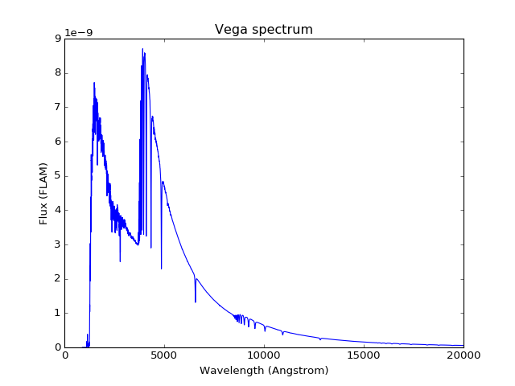

.. _stsynphot_index:

*********************************************
Synthetic Photometry for HST/JWST (stsynphot)
*********************************************

Introduction
============

**stsynphot** is an extension to :ref:`synphot <synphot:astropy_synphot>`
(:ref:`Lim et al. 2016 <stsynphot-ref-lim2016>`) that implements
synthetic photometry package for HST (and soon JWST) support. The documentation
in this package is meant to *complement* that of **synphot**, which already
documents the non-observatory specific functionalities. It is recommended that
you read both for full understanding of its capabilities.

This package, in particular, allows you to:

* Construct spectra from various grids of model atmosphere spectra,
  parameterized spectrum models, and atlases of stellar spectrophotometry.
* Simulate observations specific to HST (and soon JWST).
* Compute photometric calibration parameters for any supported instrument mode.
* Plot instrument-specific sensitivity curves and calibration target spectra.

Like ASTROLIB PYSYNPHOT (:ref:`Lim et al. 2015 <stsynphot-ref-lim2015>`),
**stsynphot** can help HST (and soon JWST) observers to perform
cross-instrument simulations and examine the transmission curve of the
Optical Telescope Assembly (OTA) and spectra of calibration targets.

If you use **stsynphot** in your work, please cite it as,
`CITATION <https://github.com/spacetelescope/stsynphot_refactor/blob/master/CITATION.md>`_
for details on how to cite it in your publications.

If you have questions or concerns regarding the software, please open an issue
at https://github.com/spacetelescope/stsynphot_refactor/issues (if not already
reported) or contact `STScI Help Desk <https://hsthelp.stsci.edu>`_.

.. _stsynphot-installation-setup:

Installation and Setup
======================

**stsynphot** works for Python 3.6 or later only. It requires the following
packages:

* numpy
* astropy
* scipy
* synphot
* beautifulsoup4
* matplotlib (optional for plotting)

You can install **stsynphot** using one of the following ways:

* From `AstroConda <https://astroconda.readthedocs.io/en/latest/>`_::

    conda install stsynphot -c http://ssb.stsci.edu/astroconda

* From ``conda-forge`` channel::

    conda install stsynphot -c conda-forge

* From standalone release::

    pip install stsynphot

* From source (example shown is for the ``dev`` version)::

    git clone https://github.com/spacetelescope/stsynphot_refactor.git
    cd stsynphot_refactor
    pip install -e .

As with ASTROLIB PYSYNPHOT, the data files for **stsynphot** are distributed
separately by
`Calibration Reference Data System <http://www.stsci.edu/hst/instrumentation/reference-data-for-calibration-and-tools/synphot-throughput-tables.html>`_.
They are expected to follow a certain directory structure under the root
directory, identified by the ``PYSYN_CDBS`` environment variable that *must* be
set prior to using this package. In the examples below, the root directory is
arbitrarily named ``/my/local/dir/cdbs/``.

In bash shell::

    export PYSYN_CDBS=/my/local/dir/cdbs/

In csh shell::

    setenv PYSYN_CDBS /my/local/dir/cdbs/

Below are the instructions to install:

.. toctree::
   :maxdepth: 1

   stsynphot/data_atlas
   stsynphot/data_hst
   stsynphot/data_jwst

.. testsetup::

    >>> # This is not marked remote data because it is essential for VEGAMAG
    >>> from stsynphot.spectrum import load_vega
    >>> load_vega(vegafile='http://ssb.stsci.edu/cdbs/calspec/alpha_lyr_stis_009.fits', encoding='binary')  # doctest: +IGNORE_OUTPUT

To ensure consistency for all data files used, **stsynphot silently overwrites
synphot data file locations within the Python session**. For example::

    >>> from synphot.config import conf as syn_conf
    >>> print(syn_conf.johnson_v_file)  # doctest: +IGNORE_OUTPUT
    http://ssb.stsci.edu/cdbs/comp/nonhst/johnson_v_004_syn.fits
    >>> from stsynphot.config import conf
    >>> print(conf.rootdir)  # doctest: +IGNORE_OUTPUT
    /my/local/dir/cdbs/
    >>> print(syn_conf.johnson_v_file)  # doctest: +IGNORE_OUTPUT
    /my/local/dir/cdbs//comp/nonhst/johnson_v_004_syn.fits

You can also take advantage of
:ref:`Astropy configuration system <astropy:astropy_config>` to manage
**stsynphot** configuration and data files. For example, you can copy
`stsynphot.cfg <https://github.com/spacetelescope/stsynphot_refactor/blob/master/stsynphot/stsynphot.cfg>`_
to your ``$HOME/.astropy/config/`` directory and modify it to your needs::

    # This replaces the need to set PYSYN_CDBS environment variable
    rootdir = /my/local/dir/cdbs/

::

    # This pins lookup tables to a specific files
    graphtable = /my/local/dir/cdbs/mtab/07r1502mm_tmg.fits
    comptable = /my/local/dir/cdbs/mtab/07r1502nm_tmc.fits
    thermtable = /my/local/dir/cdbs/mtab/tae17277m_tmt.fits

::

    # JWST primary mirror collecting area in cm^2
    area = 331830.72404

.. note::

    In theory, you can use any ``astropy.config`` functionality
    (e.g. ``set_temp()``) to manage **stsynphot** configuration items.
    However, due to the complicated relationships between instrument-specific
    data files, it is not recommended unless you know what you are doing.
    Also see :ref:`stsynphot-refdata`.

.. _stsynphot_getting_started:

Getting Started
===============

This section only contains minimal examples showing how to use this package.
For detailed documentation, see :ref:`stsynphot_using`. It is recommended that
you familiarize yourself with
:ref:`basic synphot functionality <synphot:synphot_getting_started>` first
before proceeding.

Display the current settings for graph and component tables, telescope area
(in squared centimeter), and default wavelength set (in Angstrom)::

    >>> import stsynphot as stsyn
    >>> stsyn.showref()  # doctest: +SKIP
    graphtable: /my/local/dir/cdbs/mtab/07r1502mm_tmg.fits
    comptable : /my/local/dir/cdbs/mtab/07r1502nm_tmc.fits
    thermtable: /my/local/dir/cdbs/mtab/tae17277m_tmt.fits
    area      : 45238.93416
    waveset   : Min: 500, Max: 26000, Num: 10000, Delta: None, Log: True
     [stsynphot.config]

Note that **stsynphot** also overwrites **synphot** file locations for
consistency, as stated in :ref:`stsynphot-installation-setup` (the double
slash in path name does not affect software operation)::

    >>> import synphot
    >>> synphot.conf.vega_file  # doctest: +IGNORE_OUTPUT
    '/my/local/dir/cdbs//calspec/alpha_lyr_stis_009.fits'

Plot the built-in Vega spectrum, which is used to compute VEGAMAG. This is
pre-loaded at start-up for convenience::

    >>> from synphot import units
    >>> stsyn.Vega.plot(
    ...     right=20000, flux_unit=units.FLAM,
    ...     title='Vega spectrum')  # doctest: +SKIP

Construct a bandpass for HST/ACS camera using WFC1 detector and F555W filter;
Then, show all the individual throughput files used in its construction::

    >>> bp = stsyn.band('acs,wfc1,f555w')  # doctest: +SKIP
    >>> bp.showfiles()  # doctest: +SKIP
    INFO: #Throughput table names:
    /my/local/dir/cdbs/comp/ota/hst_ota_007_syn.fits
    /my/local/dir/cdbs/comp/acs/acs_wfc_im123_004_syn.fits
    /my/local/dir/cdbs/comp/acs/acs_f555w_wfc_006_syn.fits
    /my/local/dir/cdbs/comp/acs/acs_wfc_ebe_win12f_005_syn.fits
    /my/local/dir/cdbs/comp/acs/acs_wfc_ccd1_mjd_021_syn.fits [...]

Construct a source spectrum from Kurucz 1993 Atlas of Model Atmospheres for a
star with blackbody temperature of 5770 Kelvin, at solar metallicity, and log
surface gravity of 4.5, renormalized to 20 VEGAMAG in Johnson *V* filter,
using IRAF SYNPHOT syntax::

    >>> sp = stsyn.parse_spec(
    ...     'rn(icat(k93models,5770,0.0,4.5),band(johnson,v),20,vegamag)')  # doctest: +SKIP

Construct an extinction curve for Milky Way (diffuse) with :math:`E(B-V)` of
0.7 mag. Then, apply the extinction to the source spectrum from before::

    >>> ext = stsyn.ebmvx('mwavg', 0.7)  # doctest: +REMOTE_DATA
    >>> sp_ext = sp * ext  # doctest: +SKIP

Construct an observation using the ACS bandpass and the extincted source
spectrum. (For accurate detector binning, you can pass in the binned wavelength
centers into ``binset``. In this case, the bin centers for that particular
observation mode is stored in ``bp.binset``.) Then, compute the count rate
for HST collecting area::

    >>> from synphot import Observation
    >>> obs = Observation(sp_ext, bp, binset=bp.binset)  # doctest: +SKIP
    >>> obs.countrate(area=stsyn.config.conf.area)  # doctest: +SKIP
    <Quantity 23.839134880103543 ct / s>

To find out exactly how ``bp.binset`` was computed, you can use the following
command, which states that the information for this particular ACS observation
mode in use is stored in ``wavecats/acs.dat`` in the **stsynphot** software
data directory (``synphot$``, which is named so for backward compatibility
with ASTROLIB PYSYNPHOT)::

    >>> from stsynphot import wavetable
    >>> wavetable.WAVECAT['acs,wfc1,f555w']
    'synphot$wavecats/acs.dat'

Calculate thermal background for a HST/WFC3 bandpass for its IR detector using
F110W filter::

    >>> wfc3 = stsyn.band('wfc3,ir,f110w')  # doctest: +SKIP
    >>> wfc3.thermback()  # doctest: +SKIP
    <Quantity 0.051636304994833425 ct / (pix s)>

.. _stsynphot_using:

Using **stsynphot**
===================

.. toctree::
   :maxdepth: 1

   stsynphot/overview
   stsynphot/from_pysyn_iraf
   stsynphot/obsmode
   stsynphot/spectrum
   stsynphot/refdata
   stsynphot/tutorials
   stsynphot/commissioning
   stsynphot/appendixa
   stsynphot/appendixb
   stsynphot/appendixc

.. _stsynphot_api:

API
===

.. automodapi:: stsynphot.catalog

.. automodapi:: stsynphot.config
   :no-inheritance-diagram:

.. automodapi:: stsynphot.exceptions

.. automodapi:: stsynphot.observationmode

.. automodapi:: stsynphot.spectrum

.. automodapi:: stsynphot.stio
   :no-inheritance-diagram:

.. automodapi:: stsynphot.tables
   :no-inheritance-diagram:

.. automodapi:: stsynphot.wavetable
   :no-inheritance-diagram:

.. _stsynphot_biblio:

References
==========

.. _stsynphot-ref-bessell1983:

Bessell, M. S. 1983, PASP, 95, 480

.. _stsynphot-ref-bessell1988:

Bessell, M. S. & Brett, J. M. 1988, PASP, 100, 1134

.. _stsynphot-ref-bohlin2001:

Bohlin, R. C., Dickinson, M. E., & Calzetti, D. 2001, AJ, 122, 2118

.. _stsynphot-ref-bohlin2004:

Bohlin, R. C. & Gilliland, R. L. 2004, AJ, 127, 3508

.. _stsynphot-ref-brown2014:

Brown, M. J. I., et al. 2014, ApJS, 212, 18

.. _stsynphot-ref-calzetti1994:

Calzetti, D., Kinney, A. L., & Storchi-Bergmann, T. 1994, ApJ, 429, 582

.. _stsynphot-ref-cohen2003:

Cohen, M., Wheaton, W. A., & Megeath, S. T. 2003, AJ, 126, 1090

.. _stsynphot-ref-demarchi2004:

De Marchi, G. et al. 2004, ISR ACS 2004-08: Detector Quantum Efficiency and Photometric Zero Points of the ACS (Baltimore, MD: STScI), http://www.stsci.edu/files/live/sites/www/files/home/hst/instrumentation/acs/documentation/instrument-science-reports-isrs/_documents/isr0408.pdf

.. _stsynphot-ref-diaz2012:

Diaz, R. I. 2012, pysynphot/Synphot Throughput Files: Mapping to Instrument Components for ACS, COS, and WFC3, CDBS ISR 2012-01 (Baltimore, MD: STScI)

.. _stsynphot-spark-earley1968:

Earley, J. 1968, An Efficient Context-Free Parsing Algorithm, PhD thesis, Carnegie-Mellon Univ.

.. _stsynphot-spark-earley1970:

Earley, J. 1970, An Efficient Context-Free Parsing Algorithm, CACM, 13(2), 94

.. _stsynphot-ref-francis1991:

Francis, P. J., Hewett, P. C., Foltz, C. B., Chaffee, F. H., Weymann, R. J., & Morris, S. L. 1991, ApJ, 373, 465

.. _stsynphot-ref-fukugita1996:

Fukugita, M., Ichikawa, T., Gunn, J. E., Doi, M., Shimasaku, K., & Schneider, D. P. 1996, AJ, 111, 1748

.. _stsynphot-ref-gunn2001:

`Gunn, J. E., Hogg, D., Finkbeiner, D., & Schlegel, D. 2001, Photometry White Paper <http://classic.sdss.org/dr3/algorithms/sdssphot.ps>`_

.. _stsynphot-ref-gunn1983:

Gunn, J. E. & Stryker, L. L. 1983, ApJS, 52, 121

.. _stsynphot-ref-harris1991:

Harris, H., Baum, W., Hunter, D., & Kreidl, T. 1991, AJ, 101, 677

.. _stsynphot-ref-holberg2006:

Holberg, J. B. & Bergeron, P. 2006, AJ, 132, 1221

.. _stsynphot-ref-horne1988:

Horne, K. 1988, in New Directions in Spectophotometry: A Meeting Held in Las Vegas, NV, March 28-30, Application of Synthetic Photometry Techniques to Space Telescope Calibration, ed. A. G. Davis Philip, D. S. Hayes, & S. J. Adelman (Schenectady, NY: L. Davis Press), 145

.. _stsynphot-ref-jacoby1984:

Jacoby, G. H., Hunter, D. A., & Christian, C. A. 1984, ApJS, 56, 257

.. _stsynphot-ref-johnson1965:

Johnson, H. L. 1965, ApJ, 141, 923

.. _stsynphot-ref-kinney1996:

Kinney, A. L., Calzetti, D., Bohlin, R. C., McQuade, K., Storchi-Bergmann, T., & Schmitt, H. R. 1996, ApJ, 467, 38

.. _stsynphot-ref-koornneef1986:

Koornneef, J., Bohlin, R., Buser, R., Horne, K., & Turnshek, D. 1986, Highlights Astron., 7, 833

.. _stsynphot-ref-laidler2009:

Laidler, V. 2009, TSR 2009-01: Pysynphot Commissioning Report (Baltimore, MD: STScI), http://ssb.stsci.edu/tsr/2009_01/

.. _stsynphot-ref-laidler2005:

Laidler, V., et al. 2005, Synphot User's Guide, Version 5.0 (Baltimore, MD: STScI)

.. _stsynphot-ref-laidler2008:

Laidler, V., et al. 2008, Synphot Data User's Guide, Version 1.2 (Baltimore, MD: STScI)

.. _stsynphot-ref-landolt1983:

Landolt, A. U. 1983, AJ, 88, 439

.. _stsynphot-ref-lim2015:

Lim, P. L., Diaz, R. I., & Laidler, V. 2015, PySynphot User's Guide (Baltimore, MD: STScI), https://pysynphot.readthedocs.io/en/latest/

.. _stsynphot-ref-lim2016:

Lim, P. L., et al. 2016, synphot User's Guide (Baltimore, MD: STScI), https://synphot.readthedocs.io/en/latest/

.. _stsynphot-ref-lub1977:

Lub, J. & Pel, J. W. 1977, A&A, 54, 137

.. _stsynphot-ref-lupton1999:

Lupton, R. H., Gunn, J. E., & Szalay A. S. 1999, AJ, 118, 1406

.. _stsynphot-ref-maiz2006:

Maiz Apellaniz, J. 2006, AJ, 131, 1184

.. _stsynphot-ref-morrissey2007:

Morrissey, P. et al. 2007, ApJS, 173, 682

.. _stsynphot-ref-oke1983:

Oke, J. B. & Gunn, J. E. 1983, ApJ, 266, 713

.. _stsynphot-ref-pickles1998:

Pickles, A. J. 1998, PASP, 110, 863

.. _stsynphot-ref-robitaille2013:

Robitaille, T. P., et al. 2013, A&A, 558, A33

.. _stsynphot-ref-smith2002:

Smith, J. A. et al. 2002, AJ, 123, 2121

.. _stsynphot-ref-strecker1979:

Strecker, D. W. et al. 1979, ApJS, 41, 501

.. _stsynphot-ref-vanduinen1975:

van Duinen, R. J., Aalders, J. W. G., Wesselius, P. R., Wildeman, K. J., Wu, C. C., Luinge, W., & Snel, D. 1975, A&A, 39, 159
