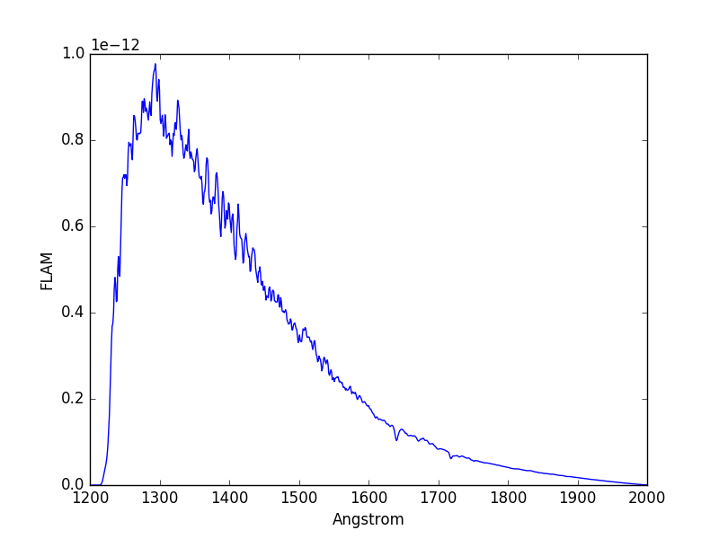

.. _stsynphot-switcher:

Switching from Legacy Software
==============================

This section provides basic switcher's guide for those who are familar with
ASTROLIB PYSYNPHOT or IRAF SYNPHOT. It complements the
:ref:`switcher's guide for synphot <synphot:synphot-switcher>` that covers
the more general functionalities. This guide is not meant to be
all-inclusive; Therefore, not all legacy commands are listed here.
This is because a legacy command can be reproduced in several different ways
using **stsynphot** or has no equivalent implementation.
Naming convention used is the same as :ref:`stsynphot-quick-guide`.
Please contact `STScI Help Desk <https://hsthelp.stsci.edu>`_ if you have
any questions.

.. _stsynphot-pysyn-switcher:

ASTROLIB Switcher Guide
-----------------------

Bandpass
^^^^^^^^

+--------------------------------------+--------------------------------------+
|**stsynphot**                         |ASTROLIB PYSYNPHOT                    |
+======================================+======================================+
|band(obsmode)                         |ObsBandpass(obsmode)                  |
+--------------------------------------+--------------------------------------+
|bp.binset                             |bp.binset                             |
+--------------------------------------+--------------------------------------+
|bp.area                               |bp.primary_area                       |
+--------------------------------------+--------------------------------------+
|len(bp)                               |len(bp)                               |
+--------------------------------------+--------------------------------------+
|bp.showfiles()                        |bp.showfiles()                        |
+--------------------------------------+--------------------------------------+
|bp.thermback()                        |bp.thermback()                        |
+--------------------------------------+--------------------------------------+

Other Spectrum
^^^^^^^^^^^^^^

+--------------------------------------+--------------------------------------+
|**stsynphot**                         |ASTROLIB PYSYNPHOT                    |
+======================================+======================================+
|ebmvx(law, val)                       |Extinction(val, law)                  |
+--------------------------------------+--------------------------------------+
|Vega                                  |Vega                                  |
+--------------------------------------+--------------------------------------+
|grid_to_spec(model, Teff, Z, log_g)   |Icat(model, Teff, Z, log_g)           |
+--------------------------------------+--------------------------------------+
|parse_spec(iraf_string)               |parse_spec(iraf_string)               |
+--------------------------------------+--------------------------------------+

Configuration
^^^^^^^^^^^^^

+--------------------------------------+--------------------------------------+
|**stsynphot**                         |ASTROLIB PYSYNPHOT                    |
+======================================+======================================+
|showref()                             |showref()                             |
+--------------------------------------+--------------------------------------+
|getref()                              |getref()                              |
+--------------------------------------+--------------------------------------+
|conf.reload()  # From stsynphot.cfg   |setref()                              |
|                                      |                                      |
|conf.reset()  # Hardcoded default     |                                      |
+--------------------------------------+--------------------------------------+
|conf.graphtable = 'mytmg.fits'        |setref(graphtable='mytmg.fits')       |
+--------------------------------------+--------------------------------------+
|conf.comptable = 'mytmc.fits'         |setref(comptable='mytmc.fits')        |
+--------------------------------------+--------------------------------------+
|conf.thermtable = 'mytmt.fits'        |setref(thermtable='mytmt.fits')       |
+--------------------------------------+--------------------------------------+
|conf.area = 123.4                     |setref(area=123.4)                    |
+--------------------------------------+--------------------------------------+
|conf.waveset_array = numpy.logspace(  |setref(waveset=(10, 10000, 1000))     |
|1, 4, 1000, endpoint=False)           |                                      |
|                                      |                                      |
|conf.waveset = 'Min: 10, Max: 10000,  |                                      |
|Num: 1000, Delta: None, Log: True'    |                                      |
+--------------------------------------+--------------------------------------+
|conf.waveset_array = numpy.linspace(  |setref(waveset=(10, 10000, 1000,      |
|10, 10000, 1000, endpoint=False)      |'linear'))                            |
|                                      |                                      |
|conf.waveset = 'Min: 10, Max: 10000,  |                                      |
|Num: 1000, Delta: None, Log: False'   |                                      |
+--------------------------------------+--------------------------------------+

.. _stsynphot-iraf-switcher:

IRAF Switcher Guide
-------------------

Bandpass
^^^^^^^^

+--------------------------------------+--------------------------------------+
|**sysynphot**                         |IRAF SYNPHOT                          |
+======================================+======================================+
|band(obsmode)                         |band(obsmode)                         |
+--------------------------------------+--------------------------------------+
|bp.area                               |refdata.area                          |
+--------------------------------------+--------------------------------------+
|bp.showfiles()                        |showfiles obsmode                     |
+--------------------------------------+--------------------------------------+
|bp.thermback()                        |thermback obsmode                     |
+--------------------------------------+--------------------------------------+

Other Spectrum
^^^^^^^^^^^^^^

+--------------------------------------+--------------------------------------+
|**stsynphot**                         |IRAF SYNPHOT                          |
+======================================+======================================+
|ebmvx(law, val)                       |ebmvx(val, law)                       |
+--------------------------------------+--------------------------------------+
|grid_to_spec(model, Teff, Z, log_g)   |icat(model, Teff, Z, log_g)           |
+--------------------------------------+--------------------------------------+
|parse_spec(iraf_string)               |See :ref:`stsynphot-language-parser`  |
+--------------------------------------+--------------------------------------+

Configuration
^^^^^^^^^^^^^

+--------------------------------------+--------------------------------------+
|**stsynphot**                         |IRAF SYNPHOT                          |
+======================================+======================================+
|showref()                             |lpar refdata                          |
+--------------------------------------+--------------------------------------+
|conf.reload()  # From stsynphot.cfg   |unlearn refdata                       |
|                                      |                                      |
|conf.reset()  # Hardcoded default     |                                      |
+--------------------------------------+--------------------------------------+
|conf.graphtable = 'mytmg.fits'        |epar refdata                          |
|                                      |                                      |
|conf.comptable = 'mytmc.fits'         |                                      |
|                                      |                                      |
|conf.area = 123.4                     |                                      |
+--------------------------------------+--------------------------------------+

Examples
^^^^^^^^

The examples below show how to accomplish some real use cases in both IRAF
SYNPHOT and **stsynphot**. The IRAF commands are preceded by ``sy>``;
They are followed by the Python equivalent in ``>>>``.
Some examples were adapted from old IRAF SYNPHOT documentation; Therefore, any
differences between the results could be due to the fact that CRDS data have
changed over time.

IRAF setup::

    iraf> stsdas
    iraf> hst_calib
    iraf> synphot
    sy>

Python imports::

    >>> import os
    >>> import stsynphot as stsyn
    >>> from synphot import units, SourceSpectrum, Observation
    >>> from synphot.models import BlackBodyNorm1D

Calculate the pivot wavelength, the equivalent Gaussian FWHM, and the total
flux (in counts/s) of a 5000 K blackbody in the HST/WFPC F555W bandpass.
The blackbody spectrum is normalized to be 18.6 VEGAMAG in *V*-band::

    sy> calcphot "band(wfpc,f555w)" "rn(bb(5000),band(v),18.6,vegamag)" counts
    Mode = band(wfpc,f555w)
    Pivot       Equiv Gaussian
    Wavelength  FWHM
    5467.653    1200.953    band(wfpc,f555w)
    Spectrum:  rn(bb(5000),band(v),18.6,vegamag)
    VZERO      (COUNTS s^-1 hstarea^-1)
    0.           419.5938

.. code-block:: python

    >>> rnbb = SourceSpectrum(BlackBodyNorm1D, temperature=5000).normalize(
    ...     18.6 * units.VEGAMAG, band=stsyn.band('v'), vegaspec=stsyn.Vega)  # doctest: +SKIP
    >>> obs = Observation(rnbb, stsyn.band('wfpc,f555w'))  # doctest: +SKIP
    >>> print(f'Pivot Wavelength: {obs.bandpass.pivot():.3f}\n'
    ...       f'Equiv Gaussian FWHM: {obs.bandpass.fwhm():.3f}\n'
    ...       f'Countrate: {obs.countrate(stsyn.conf.area):.4f}')  # doctest: +SKIP
    Pivot Wavelength: 5467.651 Angstrom
    Equiv Gaussian FWHM: 1200.923 Angstrom
    Countrate: 416.4439 ct / s

Calculate the total flux (in OBMAG) of a 5000 K blackbody in the HST/ACS
WFC1 F555W bandpass for :math:`E(B-V)` values of 0.0, 0.25, and 0.5::

    sy> calcphot "acs,wfc1,f555w" "bb(5000)*ebmv($0)" obmag vzero="0.0,0.25,0.5"
    Mode = band(acs,wfc1,f555w)
    Pivot       Equiv Gaussian
    Wavelength  FWHM
    5361.008    847.9977    band(acs,wfc1,f555w)
    Spectrum:  bb(5000)*ebmv($0)
    VZERO      (OBMAG s^-1 hstarea^-1)
    0.           -10.0087
    0.25         -9.1981
    0.5          -8.39187

.. code-block:: python

    >>> law = 'mwavg'  # stsynphot has no obsolete ebmv(), so use this instead
    >>> sp = SourceSpectrum(BlackBodyNorm1D, temperature=5000)
    >>> bp = stsyn.band('acs,wfc1,f555w')  # doctest: +SKIP
    >>> for ebv in (0.0, 0.25, 0.5):  # doctest: +SKIP
    ...     if ebv == 0:
    ...         print('VZERO\tOBMAG')  # Header
    ...     obs = Observation(sp * stsyn.ebmvx(law, ebv), bp)
    ...     print(f'{ebv}\t{obs.effstim(units.OBMAG, area=stsyn.conf.area):.4f}')
    VZERO   OBMAG
    0.0	    -10.0118 OBMAG
    0.25    -9.2167 OBMAG
    0.5     -8.4256 OBMAG

Plot an observation of BD+75 325 using the HST/ACS SBC F125LP bandpass in the
unit of FLAM. The spectral data for BD+75 325 are stored in
``$PYSYN_CDBS/calspec/bd_75d325_stis_003.fits`` file. Because this spectrum has
been arbitrarily normalized in intensity, we must first renormalize it to its
proper magnitude of 9.5 VEGAMAG in *U*-band::

    sy> plspec "acs,sbc,f125lp" "rn(crcalspec$bd_75d325_stis_003.fits,band(u),9.5,vegamag)" flam

.. image:: images/bd75325_plspec_ex1.png
    :width: 600px
    :alt: BD+75 325 observation from IRAF plspec example.

.. code-block:: python

    >>> filename = os.path.join(
    ...     os.environ['PYSYN_CDBS'], 'calspec', 'bd_75d325_stis_003.fits')  # doctest: +SKIP
    >>> sp = SourceSpectrum.from_file(filename).normalize(
    ...     9.5 * units.VEGAMAG, band=stsyn.band('u'), vegaspec=stsyn.Vega)  # doctest: +SKIP
    >>> obs = Observation(sp, stsyn.band('acs,sbc,f125lp'))  # doctest: +SKIP
    >>> obs.plot(flux_unit=units.FLAM, left=1200, right=2000)  # doctest: +SKIP

.. _stsynphot-language-parser:

IRAF Language Parser
--------------------

Like ASTROLIB PYSYNPHOT, **stsynphot** also has a special parser
(``parse_spec()``) that can read some of the legacy IRAF SYNPHOT language for
spectrum objects. The parser is based on SPARK 0.6.1 by John Aycock, which
utilizes the Earley parser (:ref:`Earley 1968 <stsynphot-spark-earley1968>`,
page 27; :ref:`Earley 1970 <stsynphot-spark-earley1970>`). The language
is described in :ref:`Laidler et al. (2005) <stsynphot-ref-laidler2005>`.
For legacy commands that are not supported by the parser (e.g., ``calcphot``
and ``bandpar``), please refer to :ref:`stsynphot-iraf-switcher` for
alternatives.

The following table lists the available operations:

+---------------------------+-------------------------------------------------+
|Parser Syntax              |**stsynphot** Equivalent                         |
+===========================+=================================================+
|band(obsmode)              |band(obsmode)                                    |
+---------------------------+-------------------------------------------------+
|bb(teff)                   |SourceSpectrum(BlackBodyNorm1D, temperature=teff)|
+---------------------------+-------------------------------------------------+
|box(mu, width)             |SpectralElement(Box1D, amplitude=1, x_0=mu,      |
|                           |width=width)                                     |
+---------------------------+-------------------------------------------------+
|ebmvx(val, law)            |ebmvx(law, val)                                  |
+---------------------------+-------------------------------------------------+
|em(mu, fwhm, flux, form)   |SourceSpectrum(GaussianFlux1D, mean=mu,          |
|                           |fwhm=fwhm, total_flux=flux*form)                 |
+---------------------------+-------------------------------------------------+
|icat(model, Teff, Z, log_g)|grid_to_spec(model, Teff, Z, log_g)              |
+---------------------------+-------------------------------------------------+
|pl(refval, expon, form)    |SourceSpectrum(PowerLawFlux1D, amplitude=1*form, |
|                           |x_0=refval, alpha=expon)                         |
+---------------------------+-------------------------------------------------+
|rn(sp, bp, val, form)      |sp.normalize(val*form, band=bp)                  |
+---------------------------+-------------------------------------------------+
|spec(filename)             |SourceSpectrum.from_file(filename)               |
+---------------------------+-------------------------------------------------+
|unit(val, form)            |SourceSpectrum(ConstFlux1D, amplitude=val*form)  |
+---------------------------+-------------------------------------------------+
|z(sp, z)                   |SourceSpectrum(sp.model, z=z)                    |
+---------------------------+-------------------------------------------------+

These are the flux units (``form``) recognized by the parser
(for wavelength, only Angstrom is accepted):

    * ``abmag``
    * ``counts``
    * ``flam``
    * ``fnu``
    * ``jy``
    * ``mjy``
    * ``obmag``
    * ``photlam``
    * ``photnu``
    * ``stmag``
    * ``vegamag``

These are the reddening laws (``law``) recognized by the parser for the
``ebmvx`` command above:

    * ``gal3`` (same as ``mwavg``)
    * ``lmc30dor``
    * ``lmcavg``
    * ``mwavg``
    * ``mwdense``
    * ``mwrv21``
    * ``mwrv40``
    * ``smcbar``
    * ``xgalsb``

This example shows how a blackbody can be generated using both the parser and
the Pythonic command. It also shows that they are equivalent::

    >>> import stsynphot as stsyn
    >>> from synphot import SourceSpectrum
    >>> from synphot.models import BlackBodyNorm1D
    >>> from numpy.testing import assert_allclose
    >>> bb1 = stsyn.parse_spec('bb(5000)')
    >>> bb2 = SourceSpectrum(BlackBodyNorm1D, temperature=5000)
    >>> assert_allclose(bb1.integrate(), bb2.integrate())

Meanwhile, this example shows how to use the parser to apply extinction to
a redshifted and renormalized spectrum obtained from a catalog. It also
generates the same spectrum using Pythonic commands and compares them.
Even though the Pythonic way takes more lines of codes to accomplish, one
might also argue that it is more readable::

    >>> from astropy import units as u
    >>> sp1 = stsyn.parse_spec(
    ...     'ebmvx(0.1, lmcavg) * z(rn(icat(k93models, 5000, -0.5, 4.4), '
    ...     'band(johnson,v), 18, abmag), 0.01)')  # doctest: +SKIP
    >>> rnsp = stsyn.grid_to_spec('k93models', 5000, -0.5, 4.4).normalize(
    ...     18 * u.ABmag, band=stsyn.band('johnson,v'))  # doctest: +SKIP
    >>> rnsp.z = 0.01  # doctest: +SKIP
    >>> sp2 = stsyn.ebmvx('lmcavg', 0.1) * rnsp  # doctest: +SKIP
    >>> assert_allclose(sp1.integrate(), sp2.integrate())  # doctest: +SKIP
