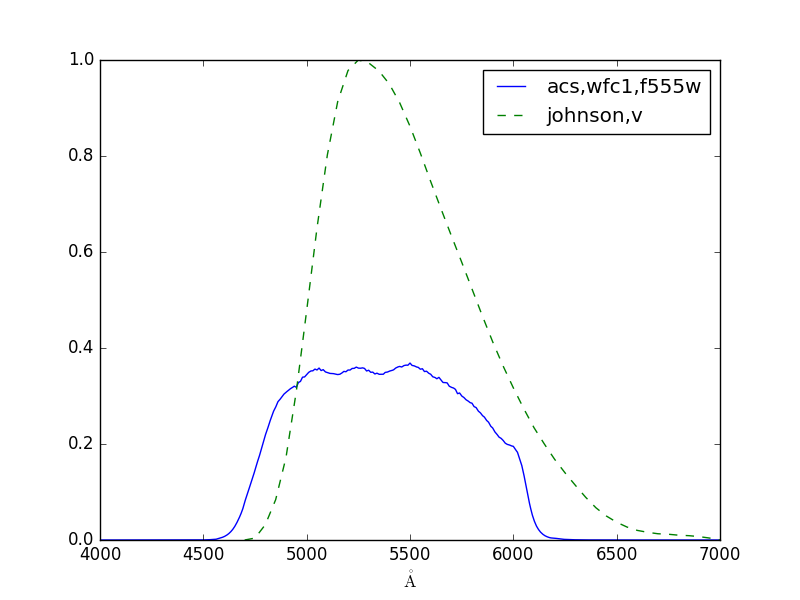
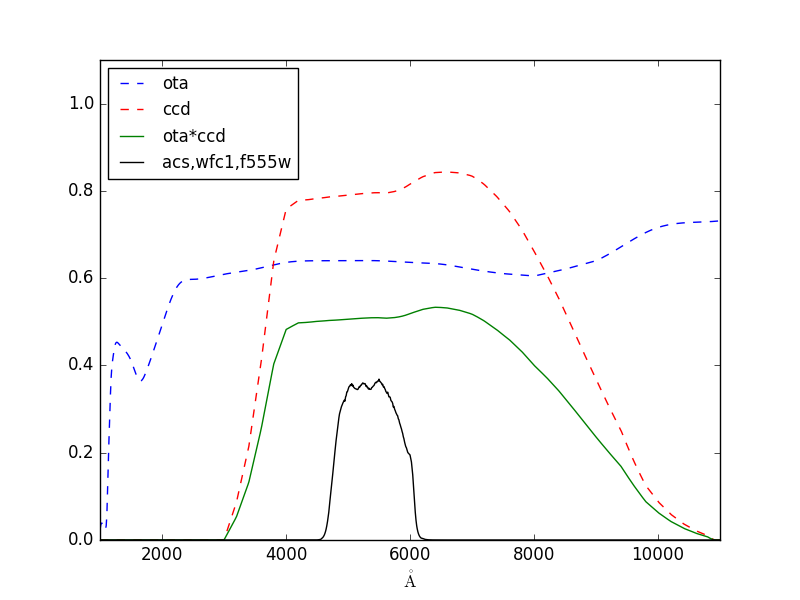

.. doctest-skip-all

.. _stsynphot-obsmode:

Observation Modes
=================

In addition to :ref:`bandpass in synphot <synphot:bandpass-main>`,
**stsynphot** adds the capability to construct a bandpass by specifying a valid
string of HST (and soon JWST) instrument mode keywords (``obsmode``).
This bandpass is the wavelength-dependent sensitivity curve of the associated
photometer or spectrophotometer. Its overview is given at
:ref:`observing mode overview <stsynphot-obsmode-overview>`.
A complete list of ``obsmode`` keywords can be found in
:ref:`<stsynphot-appendixb`.

Observation mode can be passed into :func:`~stsynphot.spectrum.band`, which
supports the strings below, to create a bandpass:

* ``'acs,hrc,f555w'``, which produces a set of chained throughputs that follow
  the light path through the telescope and the instrument
* ``'johnson,v'``, which produces a single throughput and is the same as
  reading in just ``$PYSYN_CDBS/comp/nonhst/johnson_v_004_syn.fits`` using
  :meth:`synphot.SpectralElement.from_file` that does not account for telescope
  optics

.. _stsynphot-obsmode-example:

Examples
--------

Create a bandpass for HST/ACS instrument with its WFC1 detector and F555W
filter::

    >>> import stsynphot as STS
    >>> bp_acs = STS.band('acs,wfc1,f555w')

To see which throughput tables are being used, as set by CRDS::

    >>> bp_acs.showfiles()
    /my/local/dir/cdbs/comp/ota/hst_ota_007_syn.fits
    /my/local/dir/cdbs/comp/acs/acs_wfc_im123_004_syn.fits
    /my/local/dir/cdbs/comp/acs/acs_f555w_wfc_005_syn.fits
    /my/local/dir/cdbs/comp/acs/acs_wfc_ebe_win12f_005_syn.fits
    /my/local/dir/cdbs/comp/acs/acs_wfc_ccd1_mjd_021_syn.fits [...]

Create a bandpass for Johnson *V*::

    >>> bp_v = STS.band('johnson,v')

Compare them in a plot::

    >>> import matplotlib.pyplot as plt
    >>> from astropy.visualization import quantity_support
    >>> quantity_support()
    >>> plt.plot(bp_acs.waveset, bp_acs(bp_acs.waveset), 'b',
    ...          bp_v.waveset, bp_v(bp_v.waveset), 'g--')
    >>> plt.xlim(4000, 7000)
    >>> plt.legend([bp_acs.obsmode, bp_v.obsmode], loc='best')

Read the HST OTA and ACS/WFC1 CCD transmissions from files and multiply them.
Then plot the actual bandpass and overlay those components::

    >>> from synphot import SpectralElement
    >>> ota = SpectralElement.from_file(
    ...     '/my/local/dir/cdbs/comp/ota/hst_ota_007_syn.fits')
    >>> ccd = SpectralElement.from_file(
    ...     '/my/local/dir/cdbs/comp/acs/acs_wfc_ccd1_mjd_021_syn.fits')
    >>> bp_partial = ota * ccd
    >>> w = bp_acs.binset  # waveset that is optimal for binning
    >>> plt.plot(w, ota(w), 'b--', w, ccd(w), 'r--', w, bp_partial(w), 'g', w, bp_acs(w), 'k')
    >>> plt.xlim(w[0], w[-1])
    >>> plt.ylim(0, 1.1)
    >>> plt.legend(['ota', 'ccd', 'ota*ccd', bp_acs.obsmode], loc='upper left', fontsize=12)

.. _stsynphot-command-range:

Pixel and Wavelength Ranges
---------------------------

An observation created using a bandpass from an observation mode has a binned
component associated with the its detector.
:meth:`~stsynphot.spectrum.ObservationSpectralElement.binned_pixelrange` and
:meth:`~stsynphot.spectrum.ObservationSpectralElement.binned_waverange` can be
used to calculate the pixel and wavelength ranges, respectively, spanned by the
observation mode given its ``binset``, if available.

The example below calculates the number of pixels covered from 8600.5 to
12400.5 Angstroms. Then, it calculates the starting and ending wavelengths
covered by 3800 pixels centered at 10500 Angstroms::

    >>> import stsynphot as STS
    >>> from astropy import units as u
    >>> bp = STS.band('wfc3,ir,f105w')
    >>> bp.binned_pixelrange([8600.5, 12400.5] * u.AA)
    3800
    >>> bp.binned_waverange(10500 * u.AA, 3800)
    <Quantity [  8600.5, 12400.5] Angstrom>

.. _stsynphot-command-therm:

Thermal Background
------------------

For IR detectors (e.g., NICMOS and WFC3), thermal background can be calculated
using :meth:`~stsynphot.spectrum.ObservationSpectralElement..thermback`.
The thermal component is defined by ``thermtable`` in the software
configuration system (see :ref:`stsynphot-installation-setup`).
For non-IR detectors, calling this method will raise ``NotImplementedError``.

For example::

    >>> import stsynphot as STS
    >>> bp_wfc3 = STS.band('wfc3,ir,f105w')
    >>> bp_wfc3.thermback()
    <Quantity 0.05118250271971978 ct / (pix s)>
    >>> bp_acs = STS.band('acs,wfc1,f555w')
    >>> bp_acs.thermback()
    ...
    NotImplementedError: No thermal support provided for acs,wfc1,f555w

.. _stsynphot-color-index:

Color Index
-----------

Bandpass from observation mode can also be used to calculate color indices by
comparing an observation taken with it with the same observation in another
bandpass. The color index in magnitude is computed by subtracting the effective
stimuli of the two observations; while in linear flux unit, by dividing them.

The example below (adapted from an example in the documentation of IRAF SYNPHOT
``calcphot`` task) shows you how to calculate the color indices of a
2500 K blackbody in Cousins *I* and HST/WFC3 UVIS1 F814W bandpasses::

    >>> import stsynphot as STS
    >>> from synphot import SourceSpectrum, Observation
    >>> from synphot.models import BlackBodyNorm1D
    >>> # Create the blackbody
    >>> bb = SourceSpectrum(BlackBodyNorm1D, temperature=2500)
    >>> # Create WFC3 observation
    >>> obs_wfc3 = Observation(bb, STS.band('wfc3,uvis1,f814w'))
    >>> # Create Cousins I observation using WFC3 binning for consistency
    >>> obs_i = Observation(bb, STS.band('i'), binset=obs_wfc3.binset)
    >>> # Color index in instrumental magnitude
    >>> area = STS.conf.area
    >>> obs_i.effstim('obmag', area=area) - \
    ... obs_wfc3.effstim('obmag', area=area)
    <Quantity -1.2186293262909498 OBMAG>
    >>> # Color index in FLA
    >>> obs_i.effstim('flam') / obs_wfc3.effstim('flam')
    >>> <Quantity 0.9493324538593665>
