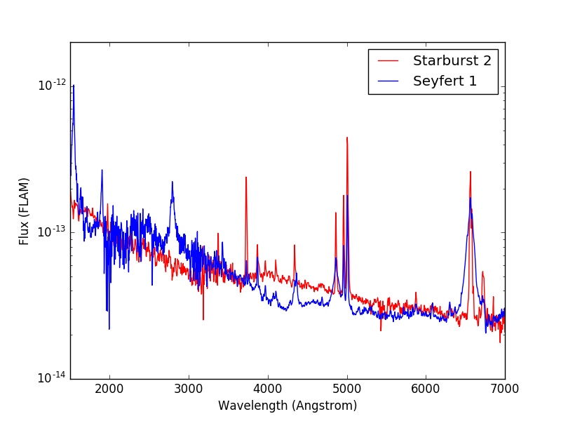
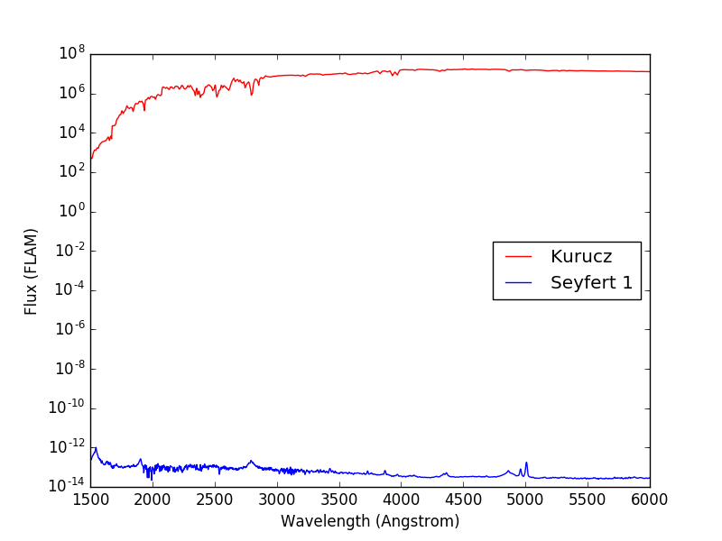

.. _stsynphot-spec-main:

Source Spectrum
===============

In addition to
:ref:`source spectrum in synphot <synphot:source-spectrum-main>`, **stsynphot**
adds the capability to use :ref:`stsynphot-crds-overview` for creating sources
from :ref:`stsynphot-spec-atlas`. The `~stsynphot.spectrum` module also provides
the following for convenience, especially for those who are used to having them
available in ASTROLIB PYSYNPHOT:

* :func:`~stsynphot.spectrum.ebmvx`, which shortens the two-step creation of an
  extinction curve from a reddening law into one. In addition, it also accepts
  `None` and ``'gal3'`` as a reddening law to be backward compatible.
  For performance, any loaded reddening law is cached, which can be cleared
  using :func:`~stsynphot.spectrum.reset_cache`.
* ``stsynphot.spectrum.Vega``, which is a preloaded
  :ref:`synphot:synphot-vega-spec` spectrum. It can be reloaded using
  :func:`~stsynphot.spectrum.load_vega` if necessary.

**Special note on count rate:**
When :meth:`~synphot.observation.Observation.countrate` is used for a HST
observation (also see
:ref:`observation in synphot <synphot:synphot_observation>`), it has two unique
features below that are ideally suited for predicting exposure times
(e.g., using `HST ETC <http://etc.stsci.edu/etc>`_) when writing HST proposals:

#. The input parameters were originally structured to mimic what is contained
   in the exposure logsheets found in HST observing proposals in
   `Astronomer's Proposal Tool (APT) <http://www.stsci.edu/scientific-community/software/astronomers-proposal-tool-apt>`_.
#. For the spectroscopic instruments, it will automatically search for and
   use a wavelength binning that is appropriate for the selected instrumental
   dispersion mode.

.. _stsynphot-spec-atlas:

Catalogs and Spectral Atlases
-----------------------------

There are many :ref:`spectral atlases <stsynphot-appendixa>` consisting of both
observed and model data that are available for use with **stsynphot**.
For these spectra, renormalization is often necessary as they had been
arbitrarily normalized before.

Plotting the spectra is a handy way to explore the contents.
For instance, if you are interested in making some HST observations of
Seyfert galaxies and want to see what sort of template spectra
are available to be used with **stsynphot** to predict observed count rates,
a good place to look would be in :ref:`stsynphot-appendixa-agn`
or :ref:`stsynphot-appendixa-kc96`. The example below plots the spectra of
a starburst and a Seyfert 1 galaxies from their respective atlases::

    >>> import os
    >>> import matplotlib.pyplot as plt  # doctest: +SKIP
    >>> from synphot import SourceSpectrum
    >>> starburst = SourceSpectrum.from_file(os.path.join(
    ...     os.environ['PYSYN_CDBS'], 'grid', 'kc96', 'starb2_template.fits'))  # doctest: +SKIP
    >>> seyfert1 = SourceSpectrum.from_file(os.path.join(
    ...     os.environ['PYSYN_CDBS'], 'grid', 'agn', 'seyfert1_template.fits'))  # doctest: +SKIP
    >>> wave = range(1500, 7000)
    >>> plt.semilogy(wave, starburst(wave, flux_unit='flam'), 'r',
    ...              wave, seyfert1(wave, flux_unit='flam'), 'b')  # doctest: +SKIP
    >>> plt.xlim(1500, 7000)  # doctest: +SKIP
    >>> plt.ylim(1E-14, 2E-12)  # doctest: +SKIP
    >>> plt.xlabel('Wavelength (Angstrom)')  # doctest: +SKIP
    >>> plt.ylabel('Flux (FLAM)')  # doctest: +SKIP
    >>> plt.legend(['Starburst 2', 'Seyfert 1'], loc='upper right')  # doctest: +SKIP

For most of the catalogs and atlases (except the three mentioned below), you
can load a spectrum :ref:`from file <synphot:synphot-source-from-file>` once
you have identified the desired filename that corresponds to the spectral
parameters that you want, as shown in the example above.

However, three of the atlases (:ref:`stsynphot-appendixa-ck04`,
:ref:`stsynphot-appendixa-kurucz1993`, and :ref:`stsynphot-appendixa-phoenix`)
have a grid of basis spectra which are indexed for various combinations of
effective temperature (:math:`T_{\text{eff}}`) in Kelvin, metallicity
(``[M/H]``), and log surface gravity (:math:`\log g`). They are best
accessed with a :func:`~stsynphot.catalog.grid_to_spec`.
You may specify any combination of the properties, so long as each is
within the allowed range, which differs from atlas to atlas. For example,
:ref:`stsynphot-appendixa-ck04` allows
:math:`3500 \; \text{K} \le T_{\text{eff}} \le 50000 \; \text{K}`,
which means that no spectrum can be constructed for effective temperatures
below 3499 K or above 50001 K (i.e., an exception will be raised).
The example below obtains the spectrum for a
:ref:`stsynphot-appendixa-kurucz1993` model with
:math:`T_{\text{eff}} = 6000 \; \text{K}`, ``[M/H] = 0``, and
:math:`\log g = 4.3`::

    >>> import stsynphot as stsyn
    >>> sp = stsyn.grid_to_spec('k93models', 6440, 0, 4.3)  # doctest: +SKIP

For completeness, the Kurucz spectrum is plotted below in comparison with
the Seyfert 1 from above. Note that the Kurucz spectrum has arbitrary
flux values and would need to be renormalize using
:meth:`~synphot.spectrum.BaseSourceSpectrum.normalize` (not done here)::

    >>> plt.semilogy(wave, sp(wave, flux_unit='flam'), 'r',
    ...              wave, seyfert1(wave, flux_unit='flam'), 'b')  # doctest: +SKIP
    >>> plt.xlim(1500, 6000)  # doctest: +SKIP
    >>> plt.xlabel('Wavelength (Angstrom)')  # doctest: +SKIP
    >>> plt.ylabel('Flux (FLAM)')  # doctest: +SKIP
    >>> plt.legend(['Kurucz', 'Seyfert 1'], loc='center right')  # doctest: +SKIP

For performance, the grid data is cached. You can use
:func:`~stsynphot.catalog.reset_cache` to clear the cache.
